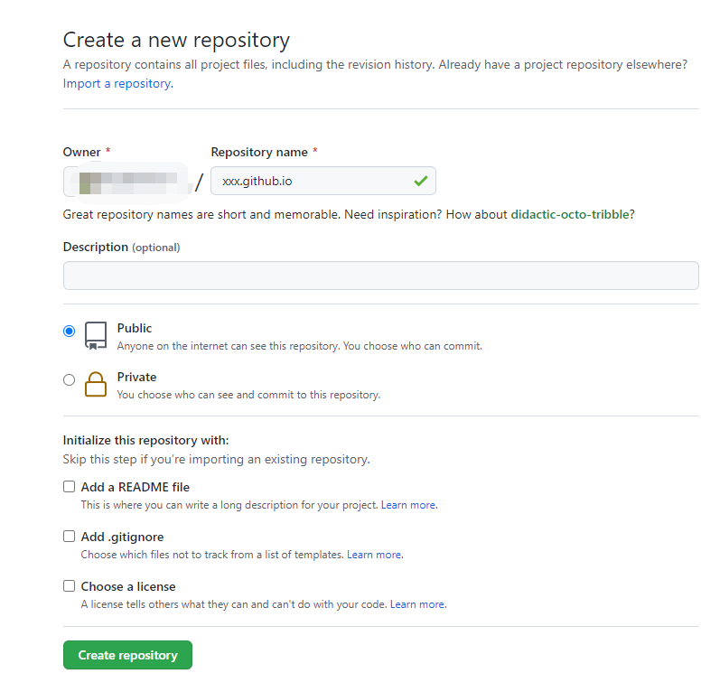

## 一、vuepress1.x 搭建

[官方文档](https://www.vuepress.cn/guide/getting-started.html)
### 1. 安装
1. `mkdir vuepress-starter && cd vuepress-starter`
2. `yarn init # npm init`
3. `yarn add -D vuepress # npm install -D vuepress`
4. `yarn docs:dev # npm run docs:dev`

### 2. 必要目录

- `docs/.vuepress/styles: 用于存放样式相关的文件。
- ` docs/.vuepress/styles/index.styl: 将会被自动应用的全局样式文件，会生成在最终的 CSS 文件结尾，具有比默认样式更高的优先级。
- ` docs/.vuepress/styles/palette.styl: 用于重写默认颜色常量，或者设置新的 stylus 颜色常量。
- ` docs/.vuepress/public: 静态资源目录。
- ` docs/.vuepress/config.js: 配置文件的入口文件，也可以是 YML 或 toml。

### 3. sidebar 配置

sidebar 作用：用于配置不同页面下展示不同的左侧导航栏

> 由于在`config.js` 需要填写所有sidebar配置比较麻烦，所以创建一个自动引入对应pages相对目录下的sidebar 的功能文件`getSidebar.js`，这样只用把配置写在相对目录的 `sidebar.js` 即可

- 页面相对目录下的文件  `pages/dir/sidebar.js` 

   ```js
   module.exports ={
    '/pages/dir/' : [
        { title:'左侧导航1',path:'/pages/dir/xxx.md'},
        { title:'左侧导航2',path:'/pages/dir/xxx.md'},
      ]
    }
   ```

- 功能文件 `docs/.vuepress/getSidebar.js` 


   ```js
    var path = require("path");
    var fs = require("fs");

    var allSidebar = {}
    var pathName=path.resolve(__dirname,'../','pages/')
    var files=fs.readdirSync(pathName)

    for (var i=0; i<files.length; i++)
    {   
        var currentPath=path.resolve(pathName+'/'+files[i]+'/sidebar.js')
        if(fs.existsSync(currentPath)){
            var sidebar = require(currentPath);
            allSidebar={
                ...sidebar,
                ...allSidebar
            }
        }

    } 
    // console.log(allSidebar)

    module.exports = allSidebar
   ```

-  `config.js` 导入 

   ```js

    var sidebar=require('./getSidebar');
    module.exports = {
        themeConfig: {
            sidebarDepth: 2,
            sidebar
        },
    }

   ```

## 二、 name.github.io 部署流程

### 1. 新建仓库 name.github.io



### 2. 创建自动化工作流，push 后自动部署
 
- 项目根目录创建文件  `.github/workflows/main.yml`   配置：
    ```yml
        name: 'projectName'  
        on: 
        push:
            branches:
            - master 
        jobs:
        build-and-deploy:
            runs-on: ubuntu-latest  
            steps:
            - name: Checkout
                uses: actions/checkout@v2.3.1   
                with: 
                persist-credentials: false
                
            - name: install and build
                run: |        
                npm install
                npm run build

            - name: Deploy
                uses: JamesIves/github-pages-deploy-action@4.1.5
                with: 
                ACCESS_TOKEN: ${{ secrets.BLOG }} //令牌
                BRANCH: gh-pages   //部署分支
                FOLDER: docs/.vuepress/dist  //访问目录
    ```

### 3. 


